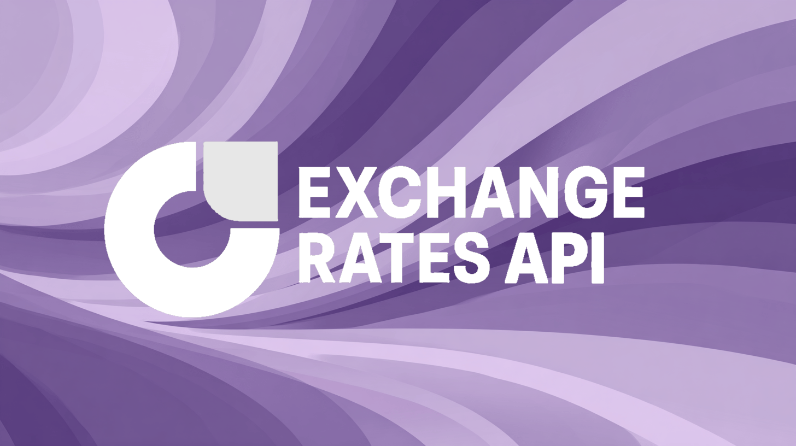

The Exchange Rates API is a developer-friendly data service providing **official Reserve Bank of Australia (RBA) exchange rate data** through clean, modern REST API endpoints. We transform publicly available RBA data (currently only accessible via HTML/RSS) into instant JSON responses.

<CardGroup cols={2}>
  <Card
    title="Official RBA Data"
    icon="school"
  >
    Direct from the Reserve Bank of Australia, updated daily
  </Card>
  <Card
    title="Simple REST API"
    icon="code"
  >
    Clean JSON responses with comprehensive error handling
  </Card>
  <Card
    title="Historical Data"
    icon="clock-rotate-left"
  >
    Complete history from 2018 onwards with 30,000+ data points
  </Card>
  <Card
    title="Free Tier"
    icon="gift"
  >
    300 requests per month on the free plan, no credit card required
  </Card>
</CardGroup>

## Why Exchange Rates API?

The Reserve Bank of Australia publishes official exchange rates daily for free, but only provides this data in:

- HTML tables requiring web scraping
- RSS/XML feeds with complex RDF namespaces  
- Excel files for historical data

Australian businesses need this **official RBA data** for:

- Tax compliance and ATO reporting
- Invoice calculations for imports/exports
- Financial reporting and auditing
- E-commerce currency conversion
- Accounting software integrations

<Note>
All data is sourced from the Reserve Bank of Australia. We are not affiliated with or endorsed by the RBA.
</Note>

## Supported Currencies

We support all currencies published by the RBA:

<AccordionGroup>
  <Accordion title="Major Currencies" icon="coins">
    - **USD** - US Dollar
    - **EUR** - Euro  
    - **GBP** - British Pound Sterling
    - **JPY** - Japanese Yen
    - **CHF** - Swiss Franc
    - **CAD** - Canadian Dollar
  </Accordion>
  
  <Accordion title="Asia-Pacific" icon="globe">
    - **CNY** - Chinese Renminbi
    - **KRW** - South Korean Won
    - **SGD** - Singapore Dollar
    - **NZD** - New Zealand Dollar
    - **HKD** - Hong Kong Dollar
    - **TWD** - Taiwan New Dollar
  </Accordion>
  
  <Accordion title="Southeast Asia" icon="chart-line">
    - **INR** - Indian Rupee
    - **THB** - Thai Baht
    - **MYR** - Malaysian Ringgit
    - **IDR** - Indonesian Rupiah
    - **VND** - Vietnamese Dong
    - **PHP** - Philippine Peso
  </Accordion>
  
</AccordionGroup>

## Quick Example

<CodeGroup>

```bash cURL
curl https://api.exchangeratesapi.com.au/latest \
  -H "Authorization: Bearer your_api_key_here"
```

```javascript JavaScript
const response = await fetch('https://api.exchangeratesapi.com.au/latest', {
  headers: {
    'Authorization': 'Bearer your_api_key_here'
  }
});

const data = await response.json();
console.log(`1 AUD = ${data.rates.USD} USD`);
```

```python Python
import requests

response = requests.get(
    'https://api.exchangeratesapi.com.au/latest',
    headers={'Authorization': 'Bearer your_api_key_here'}
)

data = response.json()
print(f"1 AUD = {data['rates']['USD']} USD")
```

```php PHP
<?php
$curl = curl_init();

curl_setopt_array($curl, array(
  CURLOPT_URL => 'https://api.exchangeratesapi.com.au/latest',
  CURLOPT_HTTPHEADER => array(
    'Authorization: Bearer your_api_key_here'
  ),
));

$response = curl_exec($curl);
$data = json_decode($response, true);

echo "1 AUD = " . $data['rates']['USD'] . " USD";
?>
```

</CodeGroup>

## Response Format

```json
{
  "success": true,
  "timestamp": 1725080400,
  "base": "AUD",
  "date": "2025-08-31",
  "rates": {
    "USD": 0.643512,
    "EUR": 0.562934,
    "GBP": 0.487421,
    "JPY": 96.832100,
    "NZD": 1.094200,
    "TWI": 60.500000
  }
}
```

## Ready to Get Started?

<Card
  title="Get Your API Key"
  icon="key"
  href="/quickstart"
>
  Sign up for free and start making API calls in under 2 minutes
</Card>